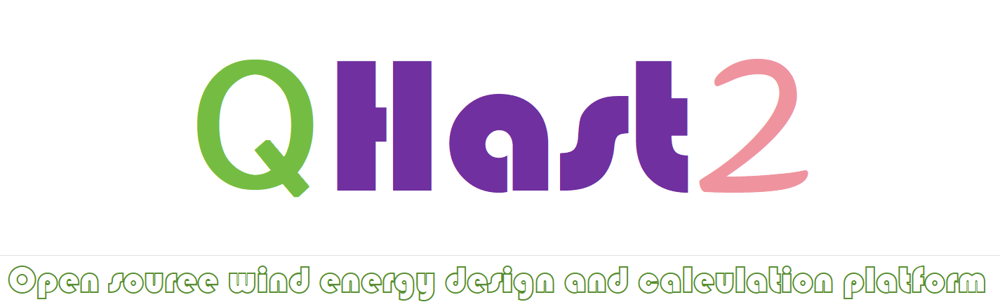

# 关于OpenHAST 的相关介绍
 OpenHAST.MBD 具有可以拓展,自由组合的优势,是下一代风力机仿真软件的标杆,由赵子祯博士首次提出了部件装配的构建方法,可以自定义的轻松实现多风轮涡轮机以及求解多体动力学行为,例如单个塔筒的涡激震动,按个叶片的震动等,目前任然在开发和实现当中.目标是替代Openfast,成为世界首屈一指的开源国产风力机设计软件的标杆!.
 OpenHAST.QHAST2 offers the advantages of extensibility and flexible combinations, making it a benchmark for next-generation wind turbine simulation software. Dr. Zhao Zizhen first proposed the component assembly construction method, allowing for easy customization to achieve multi-rotor turbines and solve multi-body dynamic behaviors, such as vortex-induced vibrations of a single tower and vibrations of individual blades. It is currently still in development and implementation. The goal is to replace OpenFAST and become the leading open-source domestic wind turbine design software in the world!
# 0 开发计划安排
## 0.0 2024年软件模块安排

### 0.0.0 模块重构
- &#10004; 初步完成任务 最基本的模块重构,将不含调用类关键字的方法重构为static 将其他方法重构为非static 方法,这样,将会为Hast.Foram的多线程和Hast.MoptL提供内存安全机制,防止计算错误.主要是内存隔离盒安全机制.大幅提高计算效率,现在的计算效率是Bladed的6倍以上,达到了Fast 80% 的计算效率,主要受限于C#的托管内存机制,尽管长度有损耗,但内存管理更加安全,不会内存泄漏!
### 0.0.1 AeroL
- &#10060; 未完成任务 FVW 模块
- &#10060; 未完成任务 接入更多的动态失速模型
### 0.0.2 ApiL
- &#10060; 未完成任务 进一步开发 api 只是一个大工程,用到什么,开发什么
### 0.0.3 BeamL
- &#10004; 已完成任务 开发动态几何精确梁
- &#10004; 已完成任务 植入静态共旋梁方法
- &#10004; 已完成任务  开发动态共旋梁模型,耦合工作正在进行
- &#10060; 未完成任务  向 MBD 模块当中耦合
### 0.0.4 PostL
- &#10060; 未完成任务  支持将计算结果直接写入到Excle文件当中,处理极限载荷
- &#10060; 未完成任务  支持将计算结果直接写入到Excle文件当中,处理疲劳载荷
### 0.0.4 MBD
- &#10060; 未完成任务  逐步支持双机头风机建模
- &#10060; 未完成任务  优化塔架和叶片TMDI 模型
- &#10060; 未完成任务  增加TMDI接口,为后期的TLD等其他被动减振方法提供开发接口
### 0.0.5 SubFEML
- &#10060; 未完成任务  支持地震波的导入,支持更多的基础模型(这个非常简单)

### 0.0.6 ControL
- &#10004; 已完成任务 支持Bladed DLL 控制器
- &#10004; 已完成任务 支持DTU DLL 控制器
- &#10004; 已完成认为 支持TUB控制器

- ## Please visit my personal website to view the latest versions and files. www.openwecd.fun
